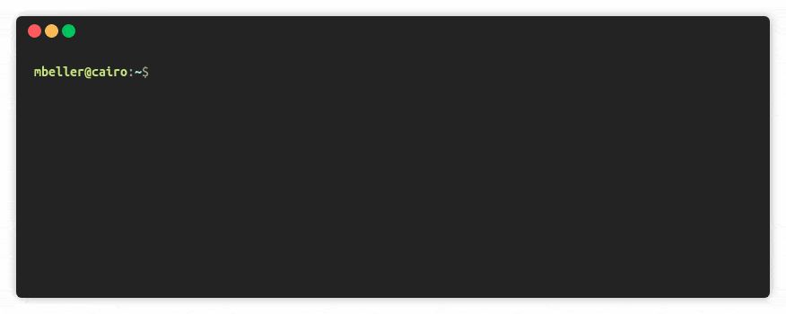

strans
======

[](https://travis-ci.com/Inventitech/strans)

`strans` (string transform) is an intuitive string manipulation
utility for the shell (primarily Unix, but should work™
cross-platform). The user does not need to know any programming. All
she needs to do is provide `strans` with a set of examples. `strans`
will automagically learn transformation rules from these examples and
apply them to the input given on STDIN.

How to Run
==========
You need [dotnet](https://dotnet.microsoft.com/) to run `strans`.

An alias (in your bashrc, ...) makes `strans` integrate seamlessly in
a Unix environment:

```
ALIAS strans="dotnet path/to/strans.dll"
```

Examples
========


## Example 1: Extract ending of files

Assume that

```
ls
Document.pdf  Document2.pdf Document.txt  Document.png
```

Now we want to get a unique list of all file endings present in the directory:

```
ls | strans -b Document.pdf -a pdf | sort -u
```

Note how nicely strans (here defined as an alias) integrates with other tools.

Of course, as
[StackOverflow](https://stackoverflow.com/questions/1842254/how-can-i-find-all-of-the-distinct-file-extensions-in-a-folder-hierarchy)
will tell you, we could obtain the same result with

```
ls | perl -ne 'print $1 if m/\.([^.\/]+)$/' | sort -u 
```

But with `strans` we accomplished the same with much less brain work,
without StackOverflow and Perl, but instead with pure joy!

## Example 2: Convert full names to their initials.

```
printf "Moritz Beller\nGeorgios Gousios" |
dotnet strans.dll -b "First Last" -a "FL"
```

neatly outputs

```
MB
GG
```

However, when we add a third entry with a middle name, Andy Emil
Zaidman, things start to break, as this does not appear in the
initials:

```
MB
GG
AZ
```

We can fix this by providing `strans` with another example. We create
a file called `example-transformations`

```
First Last => FL
Firstname Middlename Lastname => FML
```

and call

```
printf "Moritz Beller\nGeorgios Gousios\nAndy Emil Zaidman" |
dotnet strans.dll --example-file example-transformations
```

And, voila, the output is

```
MB
GG
AEZ
```

Note how `strans` adds the second example and generates a global
transformation rule that satisfies all examples given to it. Simply
having the last FML example would not be enough, because it would miss
the case where only two names are available.


Background
==========

`strans` uses program-by-example techniques from [Microsoft
PROSE](https://microsoft.github.io/prose/) to come up with the rules
behind this string manipulation. PROSE allows the creation of
extremely complex string transformations within a matter of a few
seconds by just giving easy-to-write examples. In its essence,
`strans` is only a light-weight wrapper around and direct application
of Microsoft's PROSE framework. `strans` provides the goodness of the
now-removed PowerShell (!) command
[Convert-String](https://docs.microsoft.com/en-us/powershell/module/Microsoft.PowerShell.Utility/Convert-String?view=powershell-5.1).
